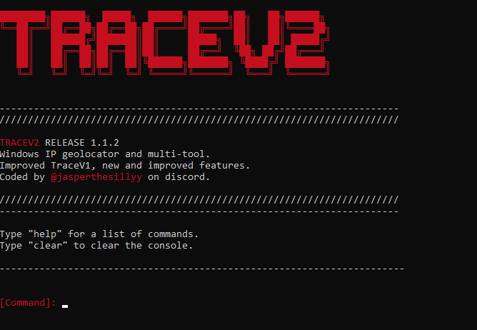

# TRACEV2 - Geolocator and MultiTool for windows.

TraceV2 is a completely open source, written in python multi-tool / geolocator made for windows.

# CHANGELOG - 1.1.2
- Added a packet sniffing tool.
- Added a port scanning tool.

This was made completely by a solo developer, so support will be appreciated.

If you find any bugs, or in general want to contact me, text me on discord: Jasper @jasperthesillyy